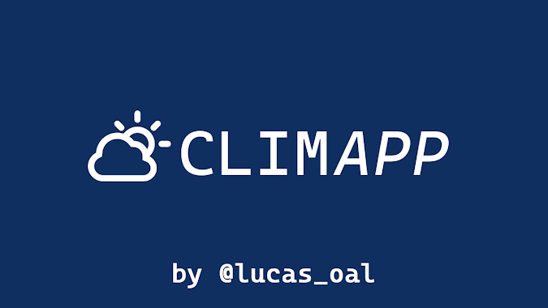

#     

*My first and simple project developed and focused for mobile. Study about APIs, Frameworks and new languages.*

 
 
 
 

## About
- [**Download**](https://github.com/lucasoal/app-weather/raw/master/climapp-v0100.apk)  
- App for Android;
- JS, React Native;
- .apk file located in the 'tempo' directory;
- [Expo](https://docs.expo.io/) as a framework;
- [HG Brasil](https://hgbrasil.com/status/weather) - API for geolocation and weather request;
