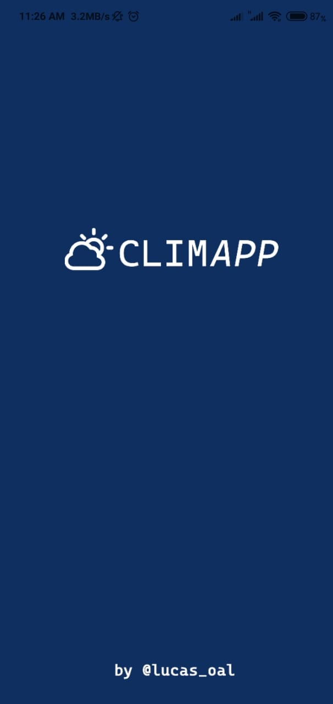

#  [](https://www.javascript.com/) [](https://reactjs.org/) [](https://www.android.com/intl/pt-BR_br/) 


*My first and simple project developed and focused for mobile. Study about APIs, Frameworks and new languages.*

 
 
 
 


## About the project

The idea of the App is:

_"Being able to check the local weather forecast and also from other cities"._

**PS:** To work, the project makes use of the api HG Brasil. This api needs a key to access the forecasts.
If the app crashes on the loading 'Carregando dados...' home screen, it means that the key has reached its maximum usage.

To change the key:

`app-weather/src/services/api.js/`

***line 10***

## Why?

This project aimed to learn and start studies on mobile application development, learn about new languages, APIs, frameworks and challenge me.

Send me an email: lucasomarandradeleal@gmail.com

Connect to my [Linkedin](https://linkedin.com/in/lucasomarandradeleal)

Feel free to use it as a study and make improvements.

***The project is opensource!!!***

## Installers

If you want to test the application, click the button below:

[Download Android .apk installer](https://github.com/lucasoal/app-weather/raw/master/climapp-v0100.apk)

iOS .ipa installer: Soon!

## Functionalities

- Get access to your location and show on the home, data about the local climate.

- **Header**
  - Time, date and city where you are
  - Interactive icon that changes depending on weather conditions
  - Local temperature

- **Conditions**
  - Wind speed
  - Sunrise time
  - Sunset time
  - Moisture percentage

- **Forecast**
  - Lists the weather forecast for the next 10 days
  - Each cell has
  - Date
  - Interactive icon
  - Maximum predicted temperature
  - Minimum expected temperature

- **Menu**
   - Allows navigation to the search tab
 
 - **Search**
    - Search for the name of the city you want to know about the weather
      - Date and city you are searching for
      - Interactive icon that changes depending on weather conditions
      - Temperature
     - Conditions
        - Wind speed
        - Sunrise time
        - Sunset time
        - Moisture percentage
       
## Getting Started

### Prerequisites

To run this project in the development mode, you'll need to have a basic environment to run a React-Native App.

Use [Expo](https://docs.expo.io/) framework to manipulate the application.

Smartphone emulator or [Expo Go app](https://play.google.com/store/apps/details?id=host.exp.exponent&hl=pt_BR&gl=US) installed.

### Installing

**Cloning the Repository**

```
$ git clone https://github.com/lucasoal/app-weather

$ cd app-weather
```

**Installing dependencies**

```
$ yarn
```

_or_

```
$ npm install
```

### Running

With all dependencies installed and the environment properly configured, you can now run the app:

In the *app-weather*  directory run the command:

`expo start`

This will open a page in your browser with a QR Code.

Scan the QR Code using the **Expo Go** app. This will emulate the application on your smartphone.

You can run it through the emulator by clicking on the option that will appear above the QR Code in the browser.

## Built With

- [React-Native](https://reactjs.org/) - Build the native app using **JavaScript** and **React**
- [React-Navigation](https://reactnavigation.org/docs/getting-started/) - Drower
- [Axios](https://github.com/axios/axios) - HTTP Client
- [HG Brasil Weather](https://hgbrasil.com/status/weather) - API for geolocation and weather request
- [React-Native-Linear-Gradient](https://github.com/react-native-community/react-native-linear-gradient) - Gradient Styles

## Support tools

- [Adobe Photoshop](https://www.adobe.com/br/products/photoshop.html?sdid=KQPOM&mv=search&ef_id=CjwKCAjw9MuCBhBUEiwAbDZ-7pp8x1aRZcX8yl7QTPdxKmjMIZex78_1SSUFBmDuDqXYv9DlU_qgWRoC6HMQAvD_BwE:G:s&s_kwcid=AL!3085!3!473120541801!e!!g!!photoshop!188192502!10077842982&gclid=CjwKCAjw9MuCBhBUEiwAbDZ-7pp8x1aRZcX8yl7QTPdxKmjMIZex78_1SSUFBmDuDqXYv9DlU_qgWRoC6HMQAvD_BwE) - Image manipulation
- [Stack Overflow](https://stackoverflow.com/) - Research and also bug fixing

## Contributing

If you have any question about the project...

Email-me: lucasomarandradeleal@gmail.com

Connect to my [Linkedin](https://linkedin.com/in/lucasomarandradeleal)

Thank you!
